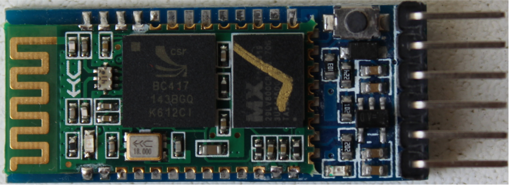

<!-- # Hardware/knowledge requirements -->

# ハードウェア/知識の要求

<!-- 
The only knowledge requirement to read this book is to know *some* Rust. It's
hard for me to quantify *some* but at least I can tell you that you don't need
to fully grok generics but you do need to know how to *use* closures. You also
need to be familiar with the idioms of the [2018 edition], in particular with
the fact that `extern crate` is not necessary in the 2018 edition.
 -->

この本を読む上で必要な知識は、Rustを*ある程度*知っていることのみです。
*ある程度*を定量的に表現することは難しいです。
ジェネリクスを完全に理解している必要はありませんが、クロージャの*使い方*を知っている必要があります。
[2018 edition]のイディオムも知っている必要があります。特に、2018 editionでは`extern crate`は必要ありません。

[2018 edition]: https://rust-lang-nursery.github.io/edition-guide/

<!-- 何故かレンダリングが崩れるため、下記文章だけ原文の上の和訳を書いています。 -->

また、資料を理解するために、次のハードウェアが必要でしょう。

（いくつかの部品はオプションですが、用意することを推奨します）

<!-- 
Also, to follow this material you'll need the following hardware:

(Some components are optional but recommended)
 -->

<!-- - A [STM32F3DISCOVERY] board. -->

- [STM32F3DISCOVERY]ボード1台

[STM32F3DISCOVERY]: http://www.st.com/en/evaluation-tools/stm32f3discovery.html

<!-- 
(You can purchase this board from "big" [electronics][0] [suppliers][1] or from [e-commerce][2]
[sites][3])
 -->

（[電子機器販売業者][0]、[サプライヤ][1]、[通信販売][2][サイト][3]でボードを購入できます）

[0]: http://www.mouser.com/ProductDetail/STMicroelectronics/STM32F3DISCOVERY
[1]: http://www.digikey.com/product-detail/en/stmicroelectronics/STM32F3DISCOVERY/497-13192-ND
[2]: https://www.aliexpress.com/wholesale?SearchText=stm32f3discovery
[3]: http://www.ebay.com/sch/i.html?_nkw=stm32f3discovery

> 訳注：2019/2/15現在、[RSオンライン]と[MOUSER]での在庫を確認しています。

[RSオンライン]: https://jp.rs-online.com/web/p/products/7692091/?grossPrice=Y&cm_mmc=JP-PPC-DS3A-_-google-_-3_JP_JP_%E3%83%97%E3%83%AD%E3%82%BB%E3%83%83%E3%82%B5+%E3%83%BB%E3%83%9E%E3%82%A4%E3%82%AF%E3%83%AD%E3%82%B3%E3%83%B3%E3%83%88%E3%83%AD%E3%83%BC%E3%83%A9%E9%96%8B%E7%99%BA%E3%82%AD%E3%83%83%E3%83%88+%26+%E3%83%9C%E3%83%BC%E3%83%89_STMicroelectronics_-_-STMicroelectronics+-+%E3%83%97%E3%83%AD%E3%82%BB%E3%83%83%E3%82%B5+%E3%83%BB%E3%83%9E%E3%82%A4%E3%82%AF%E3%83%AD%E3%82%B3%E3%83%B3%E3%83%88%E3%83%AD%E3%83%BC%E3%83%A9%E9%96%8B%E7%99%BA%E3%82%AD%E3%83%83%E3%83%88+%26+%E3%83%9C%E3%83%BC%E3%83%89+-+7692-_-stm32f3discovery&matchtype=e&kwd-301592221375&gclid=CjwKCAiAwJTjBRBhEiwA56V7qwO0gqwtq3vxhH_bzWGER_bq5El1h86TVm0RnA9eAImmbYf9zTG9dRoCDREQAvD_BwE&gclsrc=aw.ds
[MOUSER]: https://www.mouser.jp/ProductDetail/STMicroelectronics/STM32F3DISCOVERY?qs=6ddF3R%2F6EV%2Fl7MfIrXy3BQ%3D%3D

<!-- 
- OPTIONAL. A **3.3V** USB <-> Serial module. [This particular model][sparkfun] will be used
  throughout this material but you can use any other model as long as it operates at 3.3V.
 -->

- オプション。**3.3V**USB <-> シリアルモジュール。[このモジュール][sparkfun]を資料では使います。
  しかし、3.3Vで動作するモジュールであれば、他の物でも使用可能です。

[sparkfun]: https://www.sparkfun.com/products/9873

<!-- 
(The (Chinese) CH340G module, which you can buy [e-commerce][4] sites, works too and it's probably
cheaper for you to get)
 -->

((中国の)CH340Gモジュールが、[通信販売][4]サイトで購入できます。同じように動作し、より安価に入手できます。)

[4]: https://www.aliexpress.com/wholesale?SearchText=CH340G

> 訳注：[USB変換ケーブル](https://www.amazon.co.jp/GAOHOU-ESA854-Raspberry-%E3%83%A9%E3%82%BA%E3%83%99%E3%83%AA%E3%83%BC%E3%83%91%E3%82%A4%E7%94%A8%E3%81%AE-USB%EF%BC%8DTTL%E3%82%B7%E3%83%AA%E3%82%A2%E3%83%AB%E3%82%B3%E3%83%B3%E3%82%BD%E3%83%BC%E3%83%AB%E3%81%AEUSB%E5%A4%89%E6%8F%9BCOM%E3%82%B1%E3%83%BC%E3%83%96%E3%83%AB%E3%83%A2%E3%82%B8%E3%83%A5%E3%83%BC%E3%83%AB%E3%81%AE%E3%82%B1%E3%83%BC%E3%83%96%E3%83%AB/dp/B00K7YYFNM)でも大丈夫です。

 Serial module" src="../assets/serial.jpg">

<!-- - OPTIONAL. A HC-05 Bluetooth module (with headers!). A HC-06 would work too. -->

- オプション。（ヘッダ付きの）HC-05 Bluetoothモジュール1つ。HC-06モジュールも使えます。

<!-- 
(As with other Chinese parts, you pretty much can only find these on [e-commerce][5] [sites][6].
(US) Electronics suppliers don't usually stock these for some reason)
 -->

（他の中国部品と同様に、ほとんどを[通信販売][5][サイト][6]で見つけることができます。
(米国)電子機器サプライヤは通常、何らかの理由でこれらをストックしていません）

[5]: http://www.ebay.com/sch/i.html?_nkw=hc-05
[6]: https://www.aliexpress.com/wholesale?SearchText=hc-05

<!-- 
- Two mini-B USB cables. One is required to make the STM32F3DISCOVERY board work. The other is only
  required if you have the Serial <-> USB module.
 -->

- mini-B USBケーブル2本。1本はSTM32F3DISCOVERYボードを動かすのに必要です。
  もう1本は、シリアル <-> USBモジュールがある時だけ、必要です。

<!-- 
> **NOTE** These are **not** the USB cables that ship with pretty much every Android phone; those
> are *micro* USB cables. Make sure you have the right thing!
 -->

> **注記** mini-B USBケーブルは、Androidスマートフォンに付属するUSBケーブルとは**別物**です。
> Android付属のUSBケーブルは*micro*USBケーブルです。正しいものを持っていることを確認して下さい！

<!-- 
- MOSTLY OPTIONAL. 5 female to female, 4 male to female and 1 Male to Male *jumper* (AKA Dupont)
  wires. You'll *very likely* need one female to female to get ITM working. The other wires are only
  needed if you'll be using the USB <-> Serial and Bluetooth modules.
 -->

- ほぼオプション。5本のメス-メス、4本のオス-メス、1本のオス-オス*ジャンパ*（別名 Dupont）ワイヤ。
  ITMを機能させるために、1本のメス-メスワイヤが必要になる可能性が非常に高いです。
  他のワイヤは、USB <-> シリアルとBluetoothモジュールを使う場合のみ必要です。

<!-- 
(You can get these from electronics [suppliers][7] or from [e-commerce][8] [sites][9])
 -->

（電子機器[サプライヤ][7]や[通信販売][8][サイト][9]から入手できます。）

[7]: https://www.adafruit.com/categories/306
[8]: http://www.ebay.com/sch/i.html?_nkw=dupont+wire
[9]: https://www.aliexpress.com/wholesale?SearchText=dupont+wire

<!-- > **FAQ**: Wait, why do I need this specific hardware? -->

> **よくある質問と回答**：なぜ、特定のハードウェアが必要なのですか？

<!-- It makes my life and yours much easier. -->

私たちの人生をずっと簡単にします。

<!-- 
The material is much, much more approachable if we don't have to worry about hardware differences.
Trust me on this one.
 -->

ハードウェアの差異を気にしなくて良いのであれば、資料は非常に取っ付きやすいものになります。
このことについては、私を信じて下さい。

<!-- > **FAQ**: Can I follow this material with a different development board? -->

> **よくある質問と回答**：別の開発ボードでこの資料を理解できますか？

<!-- 
Maybe? It depends mainly on two things: your previous experience with microcontrollers and/or
whether there already exists a high level crate, like the [`f3`], for your development board
somewhere.
 -->

おそらく？2つの事項に依存します。あなたのこれまでのマイクロコントローラ開発経験と、
[`f3`]のような高レベルのcrateが、あなたの開発ボードに既に存在しているかどうかです。

[`f3`]: https://docs.rs/f3

<!-- 
With a different development board, this text would lose most if not all its beginner friendliness
and "easy to follow"-ness, IMO.
 -->

私の意見としては、開発ボードが異なると、初心者向けで「話についていくのが容易」というこの文書の特徴をほとんど失うでしょう。

<!-- 
If you have a different development board and you don't consider yourself a total beginner, you are
better off starting with the [quickstart] project template.
 -->

異なる開発ボードを持っていたり、自分を初心者とは考えていない場合は、[quickstart]プロジェクトテンプレートから始めた方が良いでしょう。

[quickstart]: https://rust-embedded.github.io/cortex-m-quickstart/cortex_m_quickstart/
