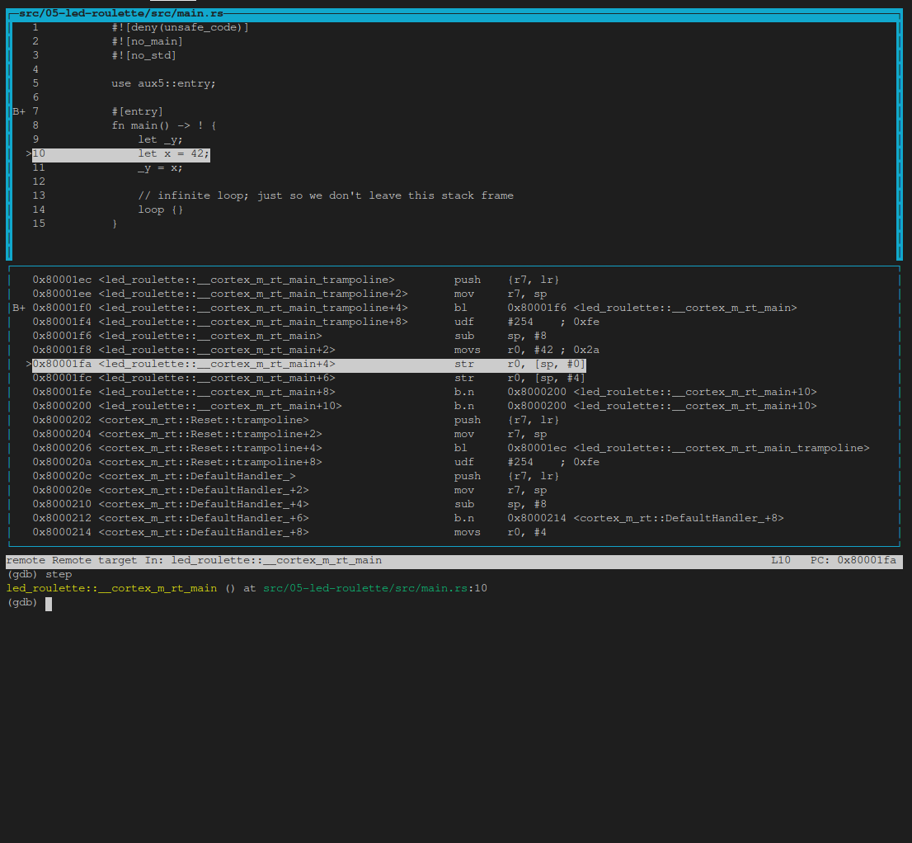

# Debug it

We are already inside a debugging session so let's debug our program.

After the `load` command, our program is stopped at its *entry point*. This is indicated by the
"Start address 0x8000XXX" part of GDB's output. The entry point is the part of a program that a
processor / CPU will execute first.

The starter project I've provided to you has some extra code that runs *before* the `main` function.
At this time, we are not interested in that "pre-main" part so let's skip right to the beginning of
the `main` function. We'll do that using a breakpoint. Issue `break main` at the `(gdb)` prompt:

> **NOTE** For these GDB commands I generally won't provide a copyable code block
> as these are short and it's faster just to type them yourself. In addition most
> can be shortened. For instance `b` for `break` or `s` for `step`, see [GDB Quick Reference]
> for more info or use Google to find your others. In addition, you can use tab completion
> by typing the first few letters than one tab to complete or two tabs to
> see all possible commands.
>
>> Finally, `help xxxx` where xxxx is the command will provide short names and other info:
>> ```
>> (gdb) help s
>> step, s
>> Step program until it reaches a different source line.
>> Usage: step [N]
>> Argument N means step N times (or till program stops for another reason).
>> ```

[GDB Quick Reference]: https://users.ece.utexas.edu/~adnan/gdb-refcard.pdf
```
(gdb) break main
Breakpoint 1 at 0x80001f0: file src/05-led-roulette/src/main.rs, line 7.
Note: automatically using hardware breakpoints for read-only addresses.
```
Next issue a `continue` command:
```
(gdb) continue
Continuing.

Breakpoint 1, led_roulette::__cortex_m_rt_main_trampoline () at src/05-led-roulette/src/main.rs:7
7       #[entry]
```

Breakpoints can be used to stop the normal flow of a program. The `continue` command will let the
program run freely *until* it reaches a breakpoint. In this case, until it reaches `#[entry]`
which is a trampoline to the main function and where `break main` sets the breakpoint.

> **Note** that GDB output says "Breakpoint 1". Remember that our processor can only use six of these
> breakpoints so it's a good idea to pay attention to these messages.

OK. Since we are stopped at `#[entry]` and using the `disassemble /m` we see the code
for entry, which is a trampoline to main. That means it sets up the stack and then
invokes a subroutine call to the `main` function using an ARM branch and link instruction, `bl`.
```
(gdb) disassemble /m
Dump of assembler code for function main:
7       #[entry]
   0x080001ec <+0>:     push    {r7, lr}
   0x080001ee <+2>:     mov     r7, sp
=> 0x080001f0 <+4>:     bl      0x80001f6 <_ZN12led_roulette18__cortex_m_rt_main17he61ef18c060014a5E>
   0x080001f4 <+8>:     udf     #254    ; 0xfe

End of assembler dump.
```

Next we need to issue a `step` GDB command which will advance the program statement
by statement stepping into functions/procedures. So after this first `step` command we're
inside `main` and are positioned at the first executable `rust` statement, line 10, but it is
**not** executed:
```
(gdb) step
led_roulette::__cortex_m_rt_main () at src/05-led-roulette/src/main.rs:10
10          let x = 42;
```

Next we'll issue a second `step` which executes line 10 and stops at
line `11    _y = x;`, again line 11 is **not** executed.

> **NOTE** We could have pressed enter at the second `(gdb) ` prompt and
> it would have reissued the previous statement, `step`, but for clarity
> in this tutorial we'll generally retype the command.

```
(gdb) step
11          _y = x;
```

As you can see, in this mode, on each `step` command GDB will print the current statement along
with its line number. As you'll see later in the TUI mode you'll not see the statement
in the command area.

We are now "on" the `_y = x` statement; that statement hasn't been executed yet. This means that `x`
is initialized but `_y` is not. Let's inspect those stack/local variables using the `print`
command, `p` for short:

```
(gdb) print x
$1 = 42
(gdb) p &x
$2 = (*mut i32) 0x20009fe0
(gdb) p _y
$3 = 536870912
(gdb) p &_y
$4 = (*mut i32) 0x20009fe4
```

As expected, `x` contains the value `42`. `_y`, however, contains the value `536870912` (?). This
is because `_y` has not been initialized yet, it contains some garbage value.

The command `print &x` prints the address of the variable `x`. The interesting bit here is that GDB
output shows the type of the reference: `*mut i32`, a mutable pointer to an `i32` value. Another
interesting thing is that the addresses of `x` and `_y` are very close to each other: their
addresses are just `4` bytes apart.

Instead of printing the local variables one by one, you can also use the `info locals` command:

```
(gdb) info locals
x = 42
_y = 536870912
```

OK. With another `step`, we'll be on top of the `loop {}` statement:

```
(gdb) step
14          loop {}
```

And `_y` should now be initialized.

```
(gdb) print _y
$5 = 42
```

If we use `step` again on top of the `loop {}` statement, we'll get stuck because the program will
never pass that statement.

> **NOTE** If you used the `step` or any other command by mistake and GDB gets stuck, you can get
> it unstuck by hitting `Ctrl+C`.

As introduced above the `disassemble /m` command can be used to disassemble the program around the
line you are currently at. You might also want to `set print asm-demangle on`
so the names are demangled, this only needs to be done once a debug session. Later
this and other commands will be placed in an initialization file which will simplify
starting a debug session.

```
(gdb) set print asm-demangle on
(gdb) disassemble /m
Dump of assembler code for function _ZN12led_roulette18__cortex_m_rt_main17h51e7c3daad2af251E:
8       fn main() -> ! {
   0x080001f6 <+0>:     sub     sp, #8
   0x080001f8 <+2>:     movs    r0, #42 ; 0x2a

9           let _y;
10          let x = 42;
   0x080001fa <+4>:     str     r0, [sp, #0]

11          _y = x;
   0x080001fc <+6>:     str     r0, [sp, #4]

12
13          // infinite loop; just so we don't leave this stack frame
14          loop {}
=> 0x080001fe <+8>:     b.n     0x8000200 <led_roulette::__cortex_m_rt_main+10>
   0x08000200 <+10>:    b.n     0x8000200 <led_roulette::__cortex_m_rt_main+10>

End of assembler dump.
```

See the fat arrow `=>` on the left side? It shows the instruction the processor will execute next.

Also, as mentioned above if you were to execute the `step` command GDB gets stuck because it
is executing a branch instruction to itself and never gets past it. So you need to use
`Ctrl+C` to regain control. An alternative is to use the `stepi`(`si`) GDB command, which steps
one asm instruction, and GDB will print the address **and** line number of the statement
the processor will execute next and it won't get stuck.

```
(gdb) stepi
0x08000194      14          loop {}

(gdb) si
0x08000194      14          loop {}
```

One last trick before we move to something more interesting. Enter the following commands into GDB:

```
(gdb) monitor reset halt
Unable to match requested speed 1000 kHz, using 950 kHz
Unable to match requested speed 1000 kHz, using 950 kHz
adapter speed: 950 kHz
target halted due to debug-request, current mode: Thread
xPSR: 0x01000000 pc: 0x08000194 msp: 0x2000a000

(gdb) continue
Continuing.

Breakpoint 1, led_roulette::__cortex_m_rt_main_trampoline () at src/05-led-roulette/src/main.rs:7
7       #[entry]

(gdb) disassemble /m
Dump of assembler code for function main:
7       #[entry]
   0x080001ec <+0>:     push    {r7, lr}
   0x080001ee <+2>:     mov     r7, sp
=> 0x080001f0 <+4>:     bl      0x80001f6 <led_roulette::__cortex_m_rt_main>
   0x080001f4 <+8>:     udf     #254    ; 0xfe

End of assembler dump.
```

We are now back at the beginning of `#[entry]`!

`monitor reset halt` will reset the microcontroller and stop it right at the beginning of the program.
The `continue` command will then let the program run freely until it reaches a breakpoint, in
this case it is the breakpoint at `#[entry]`.

This combo is handy when you, by mistake, skipped over a part of the program that you were
interested in inspecting. You can easily roll back the state of your program back to its very
beginning.

> **The fine print**: This `reset` command doesn't clear or touch RAM. That memory will retain its
> values from the previous run. That shouldn't be a problem though, unless your program behavior
> depends of the value of *uninitialized* variables but that's the definition of Undefined Behavior
> (UB).

We are done with this debug session. You can end it with the `quit` command.

```
(gdb) quit
A debugging session is active.

        Inferior 1 [Remote target] will be detached.

Quit anyway? (y or n) y
Detaching from program: $PWD/target/thumbv7em-none-eabihf/debug/led-roulette, Remote target
Ending remote debugging.
```

For a nicer debugging experience, you can use GDB's Text User Interface (TUI). To enter into that
mode enter one of the following commands in the GDB shell:

```
(gdb) layout src
(gdb) layout asm
(gdb) layout split
```

> **NOTE** Apologies to Windows users, the GDB shipped with the GNU ARM Embedded Toolchain
> may not support this TUI mode `:-(`.

Below is an example of setting up for a `layout split` by executing the follow commands.
As you can see we've dropped passing the `--target` parameter:

``` console
$ cargo run
(gdb) target remote :3333
(gdb) load
(gdb) set print asm-demangle on
(gdb) set style sources off
(gdb) break main
(gdb) continue
```

Here is a command line with the above commands as `-ex` parameters to save you some typing,
shortly we'll be providing an easier way to execute the initial set of commands:
```
cargo run -- -q -ex 'target remote :3333' -ex 'load' -ex 'set print asm-demangle on' -ex 'set style sources off' -ex 'b main' -ex 'c' target/thumbv7em-none-eabihf/debug/led-roulette
```

And below is the result:


Now we'll scroll the top source window down so we see the entire file and execute `layout split` and then `step`:



Then we'll execute a few `info locals` and `step`'s:

``` console
(gdb) info locals
(gdb) step
(gdb) info locals
(gdb) step
(gdb) info locals
```


At any point you can leave the TUI mode using the following command:

```
(gdb) tui disable
```


> **NOTE** If the default GDB CLI is not to your liking check out [gdb-dashboard]. It uses Python to
> turn the default GDB CLI into a dashboard that shows registers, the source view, the assembly view
> and other things.

[gdb-dashboard]: https://github.com/cyrus-and/gdb-dashboard#gdb-dashboard

Don't close OpenOCD though! We'll use it again and again later on. It's better
just to leave it running. If you want to learn more about what GDB can do, check out the section [How to use GDB](../appendix/2-how-to-use-gdb/).


What's next? The high level API I promised.
