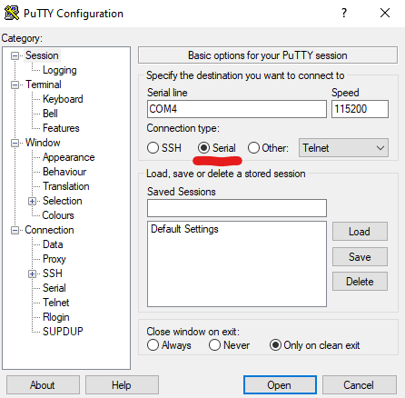

# Windows 工具

首先拔下discovery开发板。

在插入discovery开发板或串行模块之前，在终端上运行以下命令：

``` console
$ mode
```

它将打印连接到计算机的设备列表。名称中以`COM`开头的是串行设备。这是我们将要使用的设备。
在插入串行模块之前，请注意所有`COM`*端口*`mode`输出。

现在，插入discovery开发板并再次运行`mode`命令。如果您看到列表中出现了新的`COM`端口，则您有了
discovery的更新版本，这是分配给discovery的串行功能的COM端口。你可以跳过下一段。

如果您没有获得新的COM端口，则可能是发现的旧版本。现在插入串行模块；您应该会看到新的COM端口出现；这是串行模块的COM端口。

现在打开`putty`。将弹出一个GUI。

<p>

</p>

在应该打开"Session"类别的启动器屏幕上，选择"Serial"作为"Connection type"。
在"Serial line"字段中，输入上一步获得的`COM`设备，例如`COM3`。

<p>

</p>

接下来，从左侧菜单中选择"Connection/Serial" 类别。在此新视图中，确保串行端口配置如下：

- "Speed (baud)": 115200
- "Data bits": 8
- "Stop bits": 1
- "Parity": None
- "Flow control": None

最后，单击打开按钮。现在将显示控制台：

<p>

</p>

如果您在此控制台上键入，串行模块上的TX（红色）LED应闪烁。每个按键应使LED闪烁一次。
请注意，控制台不会回显您键入的内容，因此屏幕将保持空白。
