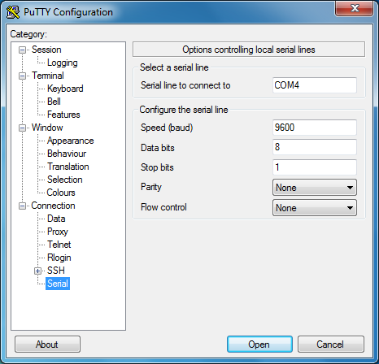
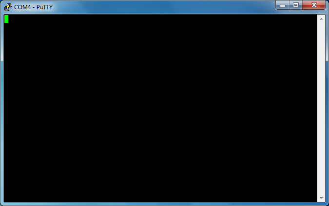

# Windows tooling

Start by unplugging your discovery board.

Before plugging the discovery board or the serial module, run the following command on
the terminal:

``` console
$ mode
```

It will print a list of devices that are connected to your computer. The ones that start with `COM` in
their names are serial devices. This is the kind of device we'll be working with. Take note of all
the `COM` *ports* `mode` outputs *before* plugging the serial module.

Now, plug the discovery board and run the `mode` command again. If you see a new
`COM` port appear on the list then you have a newer revision of the discovery
and that's the COM port assigned to the serial functionality on the discovery.
You can skip the next paragraph.

If you didn't get a new COM port then you probably have an older revision of the
discovery. Now plug the serial module; you should see new COM port appear;
that's the COM port of the serial module.

Now launch `putty`. A GUI will pop out.

<p align="center">

</p>

On the starter screen, which should have the "Session" category open, pick "Serial" as the
"Connection type". On the "Serial line" field enter the `COM` device you got on the previous step,
for example `COM3`.

Next, pick the "Connection/Serial" category from the menu on the left. On this new view, make sure
that the serial port is configured as follows:

- "Speed (baud)": 115200
- "Data bits": 8
- "Stop bits": 1
- "Parity": None
- "Flow control": None

Finally, click the Open button. A console will show up now:

<p align="center">

</p>

If you type on this console, the TX (red) LED on the Serial module should blink. Each key stroke
should make the LED blink once. Note that the console won't echo back what you type so the screen
will remain blank.
