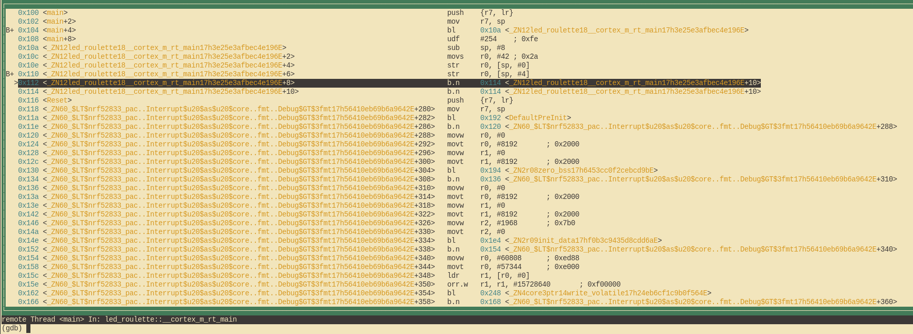

# Debug it
## How does this even work?
Before we debug our little program let's take a moment to quickly understand what is actually
happening here. In the previous chapter we already discussed the purpose of the second chip
on the board as well as how it talks to our computer, but how can we actually use it?

The little option `default.gdb.enabled = true` in `Embed.toml` made `cargo-embed` open a so-called "GDB stub" after flashing,
this is a server that our GDB can connect to and send commands like "set a breakpoint at address X" to. The server can then decide
on its own how to handle this command. In the case of the `cargo-embed` GDB stub it will forward the
command to the debugging probe on the board via USB which then does the job of actually talking to the
MCU for us.

## Let's debug!

Since `cargo-embed` is blocking our current shell we can simply open a new one and cd back into our project
directory. Once we are there we first have to open the binary in gdb like this:

```shell
# For micro:bit v2
$ gdb target/thumbv7em-none-eabihf/debug/led-roulette

# For micro:bit v1
$ gdb target/thumbv6m-none-eabi/debug/led-roulette
```

> **NOTE**: Depending on which GDB you installed you will have to use a different command to launch it,
> check out [chapter 3] if you forgot which one it was.

[chapter 3]: ../03-setup/index.md#tools

> **NOTE**: If you are getting `target/thumbv7em-none-eabihf/debug/led-roulette: No such file or directory`
> error, try adding `../../` to the file path, for example:
>
> ```shell
> $ gdb ../../target/thumbv7em-none-eabihf/debug/led-roulette
> ```
>
> This is caused by each example project being in a `workspace` that contains the entire book, and workspaces have
> a single `target` directory. Check out [Workspaces chapter in Rust Book] for more.

[Workspaces chapter in Rust Book]: https://doc.rust-lang.org/book/ch14-03-cargo-workspaces.html#creating-a-workspace

> **NOTE**: If `cargo-embed` prints a lot of warnings here don't worry about it. As of now it does not fully
> implement the GDB protocol and thus might not recognize all the commands your GDB is sending to it,
> as long as it does not crash, you are fine.

Next we will have to connect to the GDB stub. It runs on `localhost:1337` per default so in order to
connect to it run the following:

```shell
(gdb) target remote :1337
Remote debugging using :1337
0x00000116 in nrf52833_pac::{{impl}}::fmt (self=0xd472e165, f=0x3c195ff7) at /home/nix/.cargo/registry/src/github.com-1ecc6299db9ec823/nrf52833-pac-0.9.0/src/lib.rs:157
157     #[derive(Copy, Clone, Debug)]
```

Next what we want to do is get to the main function of our program.
We will do this by first setting a breakpoint there and the continuing
program execution until we hit the breakpoint:

```
(gdb) break main
Breakpoint 1 at 0x104: file src/05-led-roulette/src/main.rs, line 9.
Note: automatically using hardware breakpoints for read-only addresses.
(gdb) continue
Continuing.

Breakpoint 1, led_roulette::__cortex_m_rt_main_trampoline () at src/05-led-roulette/src/main.rs:9
9       #[entry]
```

Breakpoints can be used to stop the normal flow of a program. The `continue` command will let the
program run freely *until* it reaches a breakpoint. In this case, until it reaches the `main`
function because there's a breakpoint there.

Note that GDB output says "Breakpoint 1". Remember that our processor can only use a limited amount of these
breakpoints, so it's a good idea to pay attention to these messages. If you happen to run out of breakpoints,
you can list all the current ones with `info break` and delete desired ones with `delete <breakpoint-num>`.

For a nicer debugging experience, we'll be using GDB's Text User Interface (TUI). To enter into that
mode, on the GDB shell enter the following command:

```
(gdb) layout src
```

> **NOTE**: Apologies Windows users. The GDB shipped with the GNU ARM Embedded Toolchain doesn't
> support this TUI mode `:-(`.


GDB's break command does not only work for function names, it can also break at certain line numbers.
If we wanted to break in line 13 we can simply do:

```
(gdb) break 13
Breakpoint 2 at 0x110: file src/05-led-roulette/src/main.rs, line 13.
(gdb) continue
Continuing.

Breakpoint 2, led_roulette::__cortex_m_rt_main () at src/05-led-roulette/src/main.rs:13
(gdb)
```

At any point you can leave the TUI mode using the following command:

```
(gdb) tui disable
```

We are now "on" the `_y = x` statement; that statement hasn't been executed yet. This means that `x`
is initialized but `_y` is not. Let's inspect those stack/local variables using the `print` command:

```
(gdb) print x
$1 = 42
(gdb) print &x
$2 = (*mut i32) 0x20003fe8
(gdb)
```

As expected, `x` contains the value `42`. The command `print &x` prints the address of the variable `x`.
The interesting bit here is that GDB output shows the type of the reference: `i32*`, a pointer to an `i32` value.

If we want to continue the program execution line by line we can do that using the `next` command
so let's proceed to the `loop {}` statement:

```
(gdb) next
16          loop {}
```

And `_y` should now be initialized.

```
(gdb) print _y
$5 = 42
```

Instead of printing the local variables one by one, you can also use the `info locals` command:

```
(gdb) info locals
x = 42
_y = 42
(gdb)
```

If we use `next` again on top of the `loop {}` statement, we'll get stuck because the program will
never pass that statement. Instead, we'll switch to the disassemble view with the `layout asm`
command and advance one instruction at a time using `stepi`. You can always switch back into Rust
source code view later by issuing the `layout src` command again.

> **NOTE**: If you used the `next` or `continue` command by mistake and GDB got stuck, you can get unstuck by hitting `Ctrl+C`.

```
(gdb) layout asm
```



If you are not using the TUI mode, you can use the `disassemble /m` command to disassemble the
program around the line you are currently at.

```
(gdb) disassemble /m
Dump of assembler code for function _ZN12led_roulette18__cortex_m_rt_main17h3e25e3afbec4e196E:
10      fn main() -> ! {
   0x0000010a <+0>:     sub     sp, #8
   0x0000010c <+2>:     movs    r0, #42 ; 0x2a

11          let _y;
12          let x = 42;
   0x0000010e <+4>:     str     r0, [sp, #0]

13          _y = x;
   0x00000110 <+6>:     str     r0, [sp, #4]

14
15          // infinite loop; just so we don't leave this stack frame
16          loop {}
=> 0x00000112 <+8>:     b.n     0x114 <_ZN12led_roulette18__cortex_m_rt_main17h3e25e3afbec4e196E+10>
   0x00000114 <+10>:    b.n     0x114 <_ZN12led_roulette18__cortex_m_rt_main17h3e25e3afbec4e196E+10>

End of assembler dump.
```

See the fat arrow `=>` on the left side? It shows the instruction the processor will execute next.

If not inside the TUI mode on each `stepi` command GDB will print the statement and the line number
of the instruction the processor will execute next.

```
(gdb) stepi
16          loop {}
(gdb) stepi
16          loop {}
```

One last trick before we move to something more interesting. Enter the following commands into GDB:

```
(gdb) monitor reset
(gdb) c
Continuing.

Breakpoint 1, led_roulette::__cortex_m_rt_main_trampoline () at src/05-led-roulette/src/main.rs:9
9       #[entry]
(gdb)
```

We are now back at the beginning of `main`!

`monitor reset` will reset the microcontroller and stop it right at the program entry point.
The following `continue` command will let the program run freely until it reaches the `main`
function that has a breakpoint on it.

This combo is handy when you, by mistake, skipped over a part of the program that you were
interested in inspecting. You can easily roll back the state of your program back to its very
beginning.

> **The fine print**: This `reset` command doesn't clear or touch RAM. That memory will retain its
> values from the previous run. That shouldn't be a problem though, unless your program behavior
> depends on the value of *uninitialized* variables but that's the definition of Undefined Behavior
> (UB).

We are done with this debug session. You can end it with the `quit` command.

```
(gdb) quit
A debugging session is active.

        Inferior 1 [Remote target] will be detached.

Quit anyway? (y or n) y
Detaching from program: $PWD/target/thumbv7em-none-eabihf/debug/led-roulette, Remote target
Ending remote debugging.
[Inferior 1 (Remote target) detached]
```

> **NOTE**: If the default GDB CLI is not to your liking check out [gdb-dashboard]. It uses Python to
> turn the default GDB CLI into a dashboard that shows registers, the source view, the assembly view
> and other things.

[gdb-dashboard]: https://github.com/cyrus-and/gdb-dashboard#gdb-dashboard

If you want to learn more about what GDB can do, check out the section [How to use GDB](../appendix/2-how-to-use-gdb/).

What's next? The high level API I promised.
