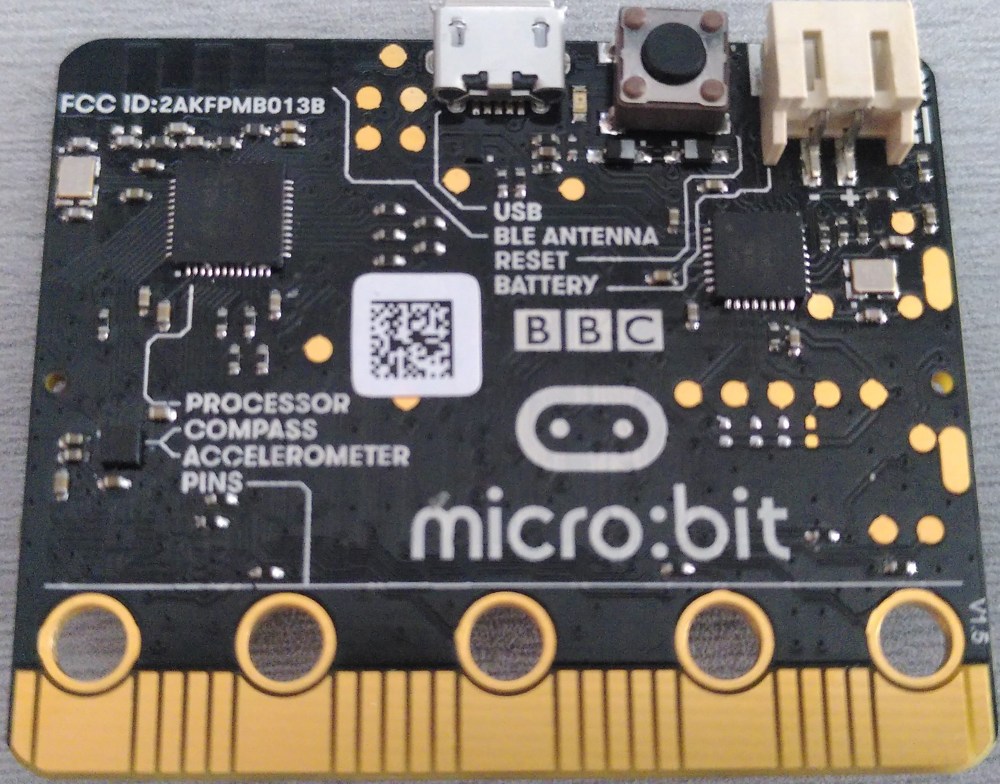

# Hardware/knowledge requirements

The primary knowledge requirement to read this book is to know *some* Rust. It's
hard for me to quantify *some* but at least I can tell you that you don't need
to fully grok generics but you do need to know how to *use* closures. You also
need to be familiar with the idioms of the [2018 edition], in particular with
the fact that `extern crate` is not necessary in the 2018 edition.

[2018 edition]: https://rust-lang-nursery.github.io/edition-guide/

Also, to follow this material you'll need the following hardware:

- A [micro:bit] board.

[micro:bit]: https://microbit.org/

(You can purchase this board from several [electronics][0] [suppliers][1])

[0]: https://microbit.org/buy/
[1]: https://www.mouser.com/microbit/_/N-aez3t?P=1y8um0l

- One micro-B USB cable, required to make the micro:bit board work.
  Make sure that the cable supports data transfer as some cables only support charging devices.

> **NOTE** Some of the micro:bit kits already do ship with such cables. Furthermore lots of USB
> cables used to charge your mobile are also micro-B ones, these cables *might* however be missing
> the capability to transmit data.

> **FAQ**: Wait, why do I need this specific hardware?

It makes my life and yours much easier.

The material is much, much more approachable if we don't have to worry about hardware differences.
Trust me on this one.

> **FAQ**: Can I follow this material with a different development board?

Maybe? It depends mainly on two things: your previous experience with microcontrollers and/or
whether a high level crate already exists, like the [nrf51-hal], for your development board
somewhere.

[nrf51-hal]: https://docs.rs/nrf51-hal

With a different development board, this text would lose most if not all its beginner friendliness
and "easy to follow"-ness, IMO.

If you have a different development board and you don't consider yourself a total beginner, you are
better off starting with the [quickstart] project template.

[quickstart]: https://rust-embedded.github.io/cortex-m-quickstart/cortex_m_quickstart/
