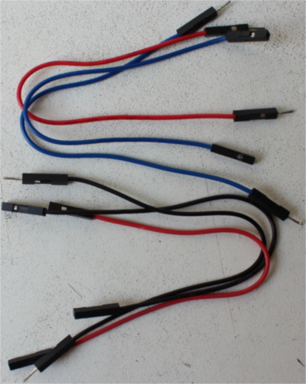

# Hardware/knowledge requirements

The primary knowledge requirement to read this book is to know *some* Rust. It's
hard for me to quantify *some* but at least I can tell you that you don't need
to fully grok generics but you do need to know how to *use* closures. You also
need to be familiar with the idioms of the [2018 edition], in particular with
the fact that `extern crate` is not necessary in the 2018 edition.

[2018 edition]: https://rust-lang-nursery.github.io/edition-guide/

Due to the nature of embedded programming, it will also be extremely helpful to
understand how binary and hexadecimal representations of values work, as well
as the use of some bitwise operators. For example, it would be useful to
understand how the following program produces its output.

```rust
fn main() {
    let a = 0x4000_0000 + 0xa2;

    // Use of the bit shift "<<" operation.
    let b = 1 << 5;

    // {:X} will format values as hexadecimal
    println!("{:X}: {:X}", a, b);
}
```

Also, to follow this material you'll need the following hardware:

(Some components are optional but recommended)

- A [STM32F3DISCOVERY] board.

[STM32F3DISCOVERY]: http://www.st.com/en/evaluation-tools/stm32f3discovery.html

(You can purchase this board from "big" [electronics][0] [suppliers][1] or from [e-commerce][2]
[sites][3])

[0]: http://www.mouser.com/ProductDetail/STMicroelectronics/STM32F3DISCOVERY
[1]: http://www.digikey.com/product-detail/en/stmicroelectronics/STM32F3DISCOVERY/497-13192-ND
[2]: https://www.aliexpress.com/wholesale?SearchText=stm32f3discovery
[3]: http://www.ebay.com/sch/i.html?_nkw=stm32f3discovery

<p align="center">

</p>

- OPTIONAL. A **3.3V** USB <-> Serial module. To elaborate: if you have one of
  the latest revisions of the discovery board (which is usually the case given
  the first revision was released years ago) then you do *not* need this module
  because the board includes this functionality on-board. If you have an older
  revision of the board then you'll need this module for chapters 10 and 11. For
  completeness, we'll include instructions for using a Serial module. The book
  will use [this particular model][sparkfun] but you can use any other model as
  long as it operates at 3.3V. The CH340G module, which you can buy
 from [e-commerce][4] sites works too and it's probably cheaper for you to get.

[sparkfun]: https://www.sparkfun.com/products/9873
[4]: https://www.aliexpress.com/wholesale?SearchText=CH340G

<p align="center">
 Serial module" src="../assets/serial.jpg">
</p>

- OPTIONAL. A HC-05 Bluetooth module (with headers!). A HC-06 would work too.

(As with other Chinese parts, you pretty much can only find these on [e-commerce][5] [sites][6].
(US) Electronics suppliers don't usually stock these for some reason)

[5]: http://www.ebay.com/sch/i.html?_nkw=hc-05
[6]: https://www.aliexpress.com/wholesale?SearchText=hc-05

<p align="center">

</p>

- Two mini-B USB cables. One is required to make the STM32F3DISCOVERY board work. The other is only
  required if you have the Serial <-> USB module. Make sure that the cables both
  support data transfer as some cables only support charging devices.

<p align="center">

</p>

> **NOTE** These are **not** the USB cables that ship with pretty much every Android phone; those
> are *micro* USB cables. Make sure you have the right thing!

- MOSTLY OPTIONAL. 5 female to female, 4 male to female and 1 Male to Male *jumper* (AKA Dupont)
  wires. You'll *very likely* need one female to female to get ITM working. The other wires are only
  needed if you'll be using the USB <-> Serial and Bluetooth modules.

(You can get these from electronics [suppliers][7] or from [e-commerce][8] [sites][9])

[7]: https://www.adafruit.com/categories/306
[8]: http://www.ebay.com/sch/i.html?_nkw=dupont+wire
[9]: https://www.aliexpress.com/wholesale?SearchText=dupont+wire

<p align="center">

</p>

> **FAQ**: Wait, why do I need this specific hardware?

It makes my life and yours much easier.

The material is much, much more approachable if we don't have to worry about hardware differences.
Trust me on this one.

> **FAQ**: Can I follow this material with a different development board?

Maybe? It depends mainly on two things: your previous experience with microcontrollers and/or
whether there already exists a high level crate, like the [`f3`], for your development board
somewhere.

[`f3`]: https://docs.rs/f3

With a different development board, this text would lose most if not all its beginner friendliness
and "easy to follow"-ness, IMO.

If you have a different development board and you don't consider yourself a total beginner, you are
better off starting with the [quickstart] project template.

[quickstart]: https://rust-embedded.github.io/cortex-m-quickstart/cortex_m_quickstart/
