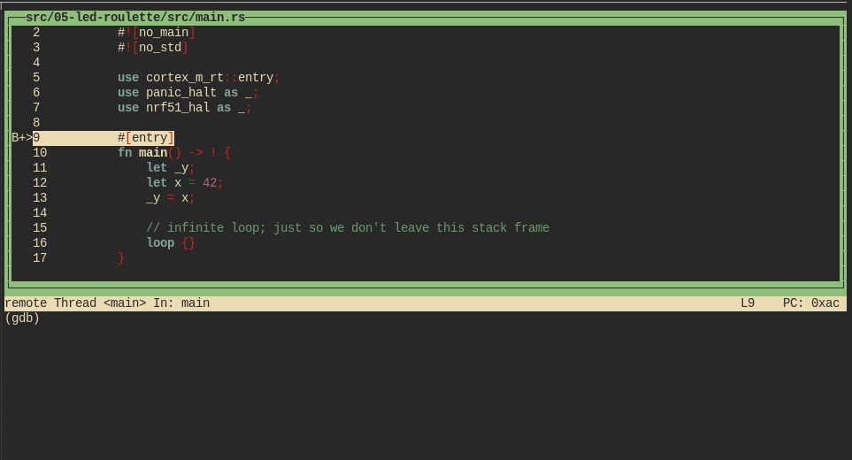
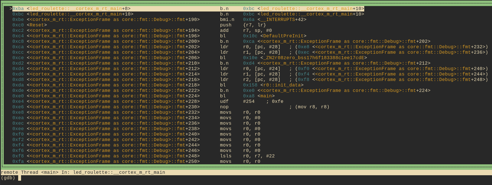

# Debug it

We are already inside a debugging session so let's debug our program.

After the `load` command, our program is stopped at its *entry point*. This is indicated by the
"Start address 0x8000XXX" part of GDB's output. The entry point is the part of a program that a
processor / CPU will execute first.

The starter project I've provided to you has some extra code that runs *before* the `main` function.
At this time, we are not interested in that "pre-main" part so let's skip right to the beginning of
the `main` function. We'll do that using a breakpoint:

```
(gdb) break main
Breakpoint 1 at 0x800018c: file src/05-led-roulette/src/main.rs, line 10.

(gdb) continue
Continuing.
Note: automatically using hardware breakpoints for read-only addresses.

Breakpoint 1, main () at src/05-led-roulette/src/main.rs:10
10          let x = 42;
```

Breakpoints can be used to stop the normal flow of a program. The `continue` command will let the
program run freely *until* it reaches a breakpoint. In this case, until it reaches the `main`
function because there's a breakpoint there.

Note that GDB output says "Breakpoint 1". Remember that our processor can only use six of these
breakpoints so it's a good idea to pay attention to these messages.

For a nicer debugging experience, we'll be using GDB's Text User Interface (TUI). To enter into that
mode, on the GDB shell enter the following command:

```
(gdb) layout src
```

> **NOTE** Apologies Windows users. The GDB shipped with the GNU ARM Embedded Toolchain doesn't
> support this TUI mode `:-(`.



At any point you can leave the TUI mode using the following command:

```
(gdb) tui disable
```

OK. We are now at the beginning of `main`. We can advance the program statement by statement using
the `step` command. So let's use that twice to reach the `_y = x` statement. Once you've typed `step`
once you can just hit enter to run it
again.

```
(gdb) step
14           _y = x;
```

If you are not using the TUI mode, on each `step` call GDB will print back the current statement
along with its line number.

We are now "on" the `_y = x` statement; that statement hasn't been executed yet. This means that `x`
is initialized but `_y` is not. Let's inspect those stack/local variables using the `print` command:

```
(gdb) print x
$1 = 42

(gdb) print &x
$2 = (i32 *) 0x10001ff4

(gdb) print _y
$3 = -536810104

(gdb) print &_y
$4 = (i32 *) 0x10001ff0
```

As expected, `x` contains the value `42`. `_y`, however, contains the value `-536810104` (?). Because
`_y` has not been initialized yet, it contains some garbage value.

The command `print &x` prints the address of the variable `x`. The interesting bit here is that GDB
output shows the type of the reference: `i32*`, a pointer to an `i32` value. Another interesting
thing is that the addresses of `x` and `_y` are very close to each other: their addresses are just
`4` bytes apart.

Instead of printing the local variables one by one, you can also use the `info locals` command:

```
(gdb) info locals
x = 42
_y = -536810104
```

OK. With another `step`, we'll be on top of the `loop {}` statement:

```
(gdb) step
17          loop {}
```

And `_y` should now be initialized.

```
(gdb) print _y
$5 = 42
```

If we use `step` again on top of the `loop {}` statement, we'll get stuck because the program will
never pass that statement. Instead, we'll switch to the disassemble view with the `layout asm`
command and advance one instruction at a time using `stepi`. You can always switch back into Rust
source code view later by issuing the `layout src` command again.

> **NOTE** If you used the `step` command by mistake and GDB got stuck, you can get unstuck by hitting `Ctrl+C`.

```
(gdb) layout asm
```



If you are not using the TUI mode, you can use the `disassemble /m` command to disassemble the
program around the line you are currently at.

```
(gdb) disassemble /m
Dump of assembler code for function main:
7       #[entry]
   0x08000188 <+0>:     sub     sp, #8
   0x0800018a <+2>:     movs    r0, #42 ; 0x2a

8       fn main() -> ! {
9           let _y;
10          let x = 42;
   0x0800018c <+4>:     str     r0, [sp, #4]

11          _y = x;
   0x0800018e <+6>:     ldr     r0, [sp, #4]
   0x08000190 <+8>:     str     r0, [sp, #0]

12
13          // infinite loop; just so we don't leave this stack frame
14          loop {}
=> 0x08000192 <+10>:    b.n     0x8000194 <main+12>
   0x08000194 <+12>:    b.n     0x8000194 <main+12>

End of assembler dump.
```

See the fat arrow `=>` on the left side? It shows the instruction the processor will execute next.

If not inside the TUI mode on each `stepi` command GDB will print the statement, the line number
*and* the address of the instruction the processor will execute next.

```
(gdb) stepi
0x08000194      14          loop {}

(gdb) stepi
0x08000194      14          loop {}
```

One last trick before we move to something more interesting. Enter the following commands into GDB:

```
(gdb) monitor reset halt
Unable to match requested speed 1000 kHz, using 950 kHz
Unable to match requested speed 1000 kHz, using 950 kHz
adapter speed: 950 kHz
target halted due to debug-request, current mode: Thread
xPSR: 0x01000000 pc: 0x08000196 msp: 0x10002000

(gdb) continue
Continuing.

Breakpoint 1, main () at src/05-led-roulette/src/main.rs:10
10          let x = 42;
```

We are now back at the beginning of `main`!

`monitor reset halt` will reset the microcontroller and stop it right at the program entry point.
The following `continue` command will let the program run freely until it reaches the `main`
function that has a breakpoint on it.

This combo is handy when you, by mistake, skipped over a part of the program that you were
interested in inspecting. You can easily roll back the state of your program back to its very
beginning.

> **The fine print**: This `reset` command doesn't clear or touch RAM. That memory will retain its
> values from the previous run. That shouldn't be a problem though, unless your program behavior
> depends of the value of *uninitialized* variables but that's the definition of Undefined Behavior
> (UB).

We are done with this debug session. You can end it with the `quit` command.

```
(gdb) quit
A debugging session is active.

        Inferior 1 [Remote target] will be detached.

Quit anyway? (y or n) y
Detaching from program: $PWD/target/thumbv7em-none-eabihf/debug/led-roulette, Remote target
Ending remote debugging.
```

> **NOTE** If the default GDB CLI is not to your liking check out [gdb-dashboard]. It uses Python to
> turn the default GDB CLI into a dashboard that shows registers, the source view, the assembly view
> and other things.

[gdb-dashboard]: https://github.com/cyrus-and/gdb-dashboard#gdb-dashboard

Don't close OpenOCD though! We'll use it again and again later on. It's better
just to leave it running.

What's next? The high level API I promised.
