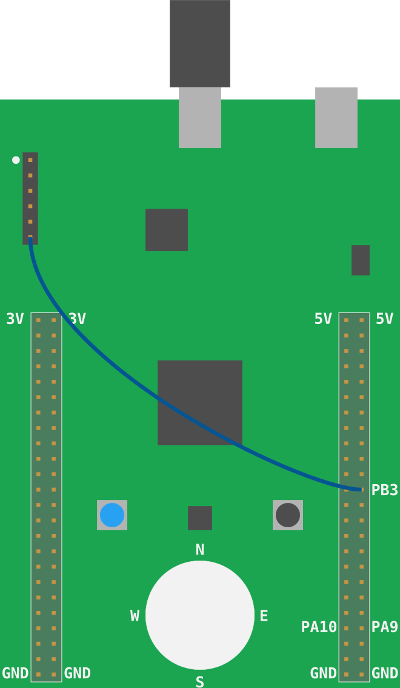

# Hello, world!

> **HEADS UP** The "solder bridge" SB10 (see back of the board) on the STM32F3DISCOVERY, which is
> required to use the ITM and the `iprint!` macros shown below, is **not** soldered by default
> (see page 21 of the [User Manual][]).

> **TL;DR** You have two options to fix this: Either **solder** the solder bridge SB10 or connect a
> female to female jumper wire between SWO and PB3 as shown in the picture below.

[User Manual]: http://www.st.com/resource/en/user_manual/dm00063382.pdf

<p align="center">

</p>

---

Just a little more of helpful magic before we start doing low level stuff.

Blinking an LED is like the "Hello, world" of the embedded world.

But in this section, we'll run a proper "Hello, world" program that prints stuff to your computer
console.

Go to the `06-hello-world` directory. There's some starter code in it:

``` rust
{{#include src/main.rs}}
```

The `iprintln` macro will format messages and output them to the microcontroller's *ITM*. ITM stands
for Instrumentation Trace Macrocell and it's a communication protocol on top of SWD (Serial Wire
Debug) which can be used to send messages from the microcontroller to the debugging host. This
communication is only *one way*: the debugging host can't send data to the microcontroller.

OpenOCD, which is managing the debug session, can receive data sent through this ITM *channel* and
redirect it to a file.

The ITM protocol works with *frames* (you can think of them as Ethernet frames). Each frame has a
header and a variable length payload. OpenOCD will receive these frames and write them directly to a
file without parsing them. So, if the microntroller sends the string "Hello, world!" using the
`iprintln` macro, OpenOCD's output file won't exactly contain that string.

To retrieve the original string, OpenOCD's output file will have to be parsed. We'll use the
`itmdump` program to perform the parsing as new data arrives.

You should have already installed the `itmdump` program during the [installation chapter].

[installation chapter]: ../03-setup/index.html#itmdump

In a new terminal, run this command inside the `/tmp` directory, if you are using a \*nix OS, or from
within the `%TEMP%` directory, if you are running Windows. This should be the same directory from
where you are running OpenOCD.

> **NOTE** It's very important that both `itmdump` and `openocd` are running
from the same directory!

``` console
$ # itmdump terminal

$ # *nix
$ cd /tmp && touch itm.txt

$ # Windows
$ cd %TEMP% && type nul >> itm.txt

$ # both
$ itmdump -F -f itm.txt
```

This command will block as `itmdump` is now watching the `itm.txt` file. Leave this terminal open.

Make sure that the STM32F3DISCOVERY board is connected to your computer. Open another terminal
from `/tmp` directory (on Windows `%TEMP%`) to launch OpenOCD similar as described in [chapter 3].

[chapter 3]: ../03-setup/verify.html#first-openocd-connection

Alright. Now, let's build the starter code and flash it into the microcontroller.

We will now build and run the application, `cargo run`. And step through it using `next`.
Since `openocd.gdb` contains the `monitor` commands in `openocd.gdb` OpenOCD will redirect
the ITM output to itm.txt and `itmdump` will write it to its terminal window. Also, it setup
break points and stepped through the trampoline we are at the first executable
statement in `fn main()`:

``` console
~/embedded-discovery/src/06-hello-world
$ cargo run
    Finished dev [unoptimized + debuginfo] target(s) in 0.01s
     Running `arm-none-eabi-gdb -q -x ../openocd.gdb ~/embedded-discovery/target/thumbv7em-none-eabihf/debug/hello-world`
Reading symbols from ~/embedded-discovery/target/thumbv7em-none-eabihf/debug/hello-world...
hello_world::__cortex_m_rt_main () at ~/embedded-discovery/src/06-hello-world/src/main.rs:14
14          loop {}
Loading section .vector_table, size 0x194 lma 0x8000000
Loading section .text, size 0x2828 lma 0x8000194
Loading section .rodata, size 0x638 lma 0x80029bc
Start address 0x08000194, load size 12276
Transfer rate: 18 KB/sec, 4092 bytes/write.
Breakpoint 1 at 0x80001f0: file ~/embedded-discovery/src/06-hello-world/src/main.rs, line 8.
Note: automatically using hardware breakpoints for read-only addresses.
Breakpoint 2 at 0x800092a: file /home/wink/.cargo/registry/src/github.com-1ecc6299db9ec823/cortex-m-rt-0.6.13/src/lib.rs, line 570.
Breakpoint 3 at 0x80029a8: file /home/wink/.cargo/registry/src/github.com-1ecc6299db9ec823/cortex-m-rt-0.6.13/src/lib.rs, line 560.

Breakpoint 1, hello_world::__cortex_m_rt_main_trampoline () at ~/embedded-discovery/src/06-hello-world/src/main.rs:8
8       #[entry]
hello_world::__cortex_m_rt_main () at ~/embedded-discovery/src/06-hello-world/src/main.rs:10
10          let mut itm = aux6::init();

(gdb)
```

Now issue a `next` command which will exectue `aux6::init()` and
stop at the next executable statement in `main.rs`, which
positions us at line 12:

``` text
(gdb) next
12	    iprintln!(&mut itm.stim[0], "Hello, world!");
```

Then issue another `next` command which will execute
line 12, executing the `iprintln` and stop at line 14:

``` text
(gdb) next
14	    loop {}
```

Now since `iprintln` has been executed the output on the `itmdump`
terminal window should be the `Hello, world!` string:

``` console
$ itmdump -F -f itm.txt
(...)
Hello, world!
```

Awesome, right? Feel free to use `iprintln` as a logging tool in the coming sections.

Next: That's not all! The `iprint!` macros are not the only thing that uses the ITM. `:-)`
