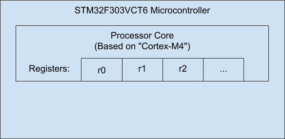
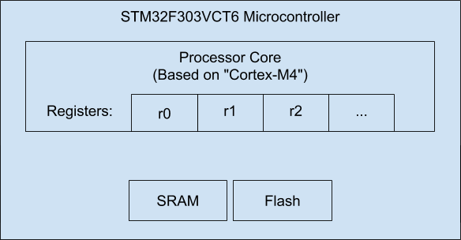
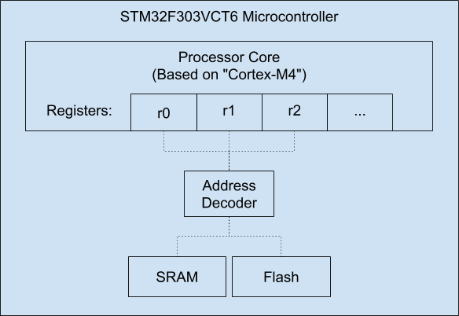

# Memory Mapping

To understand what was going on with the prior code, let's take an even deeper
look at our microcontroller, and the concept of **memory mapping**.

## Processor Cores

Our microcontroller has a **processor core** (often referred to as just the
"**core**" or the "**processor**"). This is the part of the microcontroller
that performs basic computations like adding, subtracting, comparing, etc. It
also has some **registers**, small areas of storage (32-bits each) used by the
processor for temporary storage of values.

<div style="width: 100%">
</img>
</div>

Let's assume that we have written a program that adds two numbers together. The
compiler looks at our code and generates instructions for the processor to
follow. The instructions generated might look like the following:

* Copy the first number into register `r1`.
* Copy the second number into register `r2`.
* Perform the add operation using `r1` and `r2`, storing the results in register `r3`.

Of course, we need somewhere to store all of our instructions and values that
we want the instructions to act on. There aren't enough registers to store all
of that. This is why we have **memory**.

## Memory

All microcontrollers are a bit different. One of those differences is the size and type
of memory offered. Our microcontroller has two different kinds of memory: [Flash] and [SRAM].
These sit on the microcontroller, but outside of the processor.

[Flash]: https://en.wikipedia.org/wiki/Flash_memory
[SRAM]: https://en.wikipedia.org/wiki/Static_random-access_memory

<div style="width: 100%">
</img>
</div>

Let's expand our "add two numbers" example from before, now introducing memory. Here are
instruction that a compiler might generate for the processor to execute:

1. Read from Flash address `0x00`. Store the value in processor register `r1`.
1. Read from Flash address `0x04`. Store the value in processor register `r2`.
1. Perform the add operation. Store the results in processor register `r3`.
1. Write the value stored in `r3` to SRAM address `0x00`.

> Each register is 32 bits in size. Each address points to a single byte (8-bits) of
> memory. Therefore, if you ask to perform an operation to read 32-bits from memory,
> you'll read from more than just the address you initially point to. For example,
> reading 32-bits from address `0x00` will cause us to read not only the 8-bits in
> `0x00`, but additionally the eight bits from `0x01`, `0x02` and `0x03`. This is why
> our second value would be found following address `0x04`.

Our processor generally provides two potential instructions for memory
operations: one to read from an address in memory, and another to write to an
address in memory. But if all we can provide to these instructions is an
address, how does the processor know _which_ type of memory to use? For
example, if we ask the processor to load from memory address `0x00`, how does
the processor know whether to look at the first byte of Flash or the first byte
of SRAM?

The solution used by the designers of our processor is to assign all of the
addresses from both memory types onto one global address space. For example, we
could create a simple mapping of values that looks like this:

```
Addresses 0x0000_0000 - 0x0003_FFFF: 256kb Flash
Addresses 0x0004_0000 - 0x0004_BFFF: 48kb SRAM
```

> This isn't the actual map for your controller, but useful as an example.

If we were to give the processor an address, here is what the underlying hardware would do with
that address:

```
0x0000_0000: Access the first byte (`0x00`) of Flash.
0x0000_0003: Access the fourth byte (`0x03`) of Flash.
0x0003_FFFF: Access the final byte of Flash.
0x0004_0000: Access the first byte (`0x00`) of SRAM.
0x0004_0004: Access the fourth byte (`0x04`) of SRAM.
0x0004_BFFF: Access the final address of SRAM.
```

As a result, manufacturers can what types and sizes of memory to to build into
their microcontrollers, and the processor core doesn't need to really be
redesigned. The manufacturers just need to include a "decoder" on the
microcontroller, which is the piece of hardware that can make these conversions
for the processor.

<div style="width: 100%">

</div>

## Back to our Example

Knowing this, let's go back to the example at the start of this chapter.

```
// A magic address!
const GPIOE_BSRR: u32 = 0x48001018;

// Turn on the "North" LED (red)
*(GPIOE_BSRR as *mut u32) = 1 << 9;
```

The above code reads from the address `0x4800_1018`. This could be RAM, or it
could be Flash. On a different microcontroller, this address could be something
else entirely. But why would writing a value to memory light up our LED?

To understand this, we need to learn about one more important topic.
