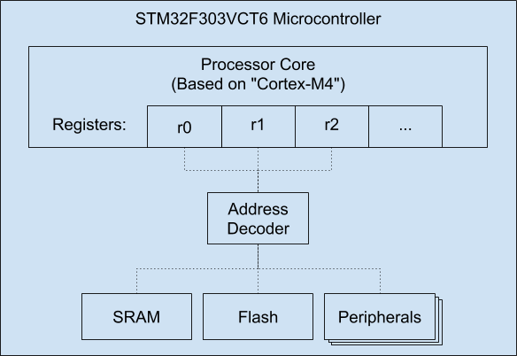

# Peripherals

As shown in the last section, your microcontroller has a processor and some
forms of memory. But those are not the only thing located on the microcontroller.
There are a bunch of other useful pieces of hardware; hardware to control
timers, or to control pins for general usage, or to communicate
over a serial connection like USB, etc. All of these additional items on the
microcontroller are known as **Peripherals**.

Once again, we want the processor to be able to interact with these components,
but we don't want to make the processor too complicated. Like we did with memory,
we will assign some of the addresses in our memory map for the peripherals.
This means that the processor can now access these peripherals using the
typical memory read and write instructions. This strategy of connecting a
processor to peripherals is known as **Memory-Mapped I/O**.

<div style="width: 100%">
</img>
</div>

When the processor is instructed to access an address assigned to a peripheral,
it will access what is known as a **register**. These are parts of the peripheral
specifically designed to be read from (or written to) as if they were memory.
A peripheral may have _multiple_ such registers, each one having a different purpose.
For example, a timer peripheral might have one register that is written to to control
how the timer will operate and start, while another register can be read from
to determine how much time has elapsed since the timer was started.

## GPIO

Let's turn our attention to the **GPIO** peripheral. GPIO stands for "General
Purpose Input/Output", and it's the peripheral you use to control the "general
purpose" pins on the microcontroller. These pins can be attached to any type of
hardware which operates through electrical circuitry: LEDs, LCDs, buttons, etc.

Let's look back once again to the code from earlier in the chapter:

```
const GPIOE_BSRR: u32 = 0x48001018;

// Turn on the "North" LED (red)
*(GPIOE_BSRR as *mut u32) = 1 << 9;

// Turn on the "East" LED (green)
*(GPIOE_BSRR as *mut u32) = 1 << 11;
```

As we can see, we start with a specific byte in address `0x48001018`. We can
assume that this address will be mapped to one of the registers for the GPIO
peripheral. It also appears that we can "enable" a pin (which has the effect of
turning the LED on) by setting `1` to a specific bit. Finally, we can `disable`
that pin (which as the effect of turning the LED off) by setting `1` to a
different bit.

We have mainly solved the mystery of why code that seems to be accessing memory
is actually lighting up LEDs. The address must be mapped to a register in the
GPIO peripheral. Our interacting with that register is causing the GPIO
peripheral to enable or disable pins, causing LEDs to turn on or off.

However, there are still more questions to answer: how do we find out what
address we needed to modify in order to interact with the GPIO peripheral? How
did we know what value to use in that register to have the desired effects? To
answer these questions is that we needed to RTRM (Read the Reference Manual).
